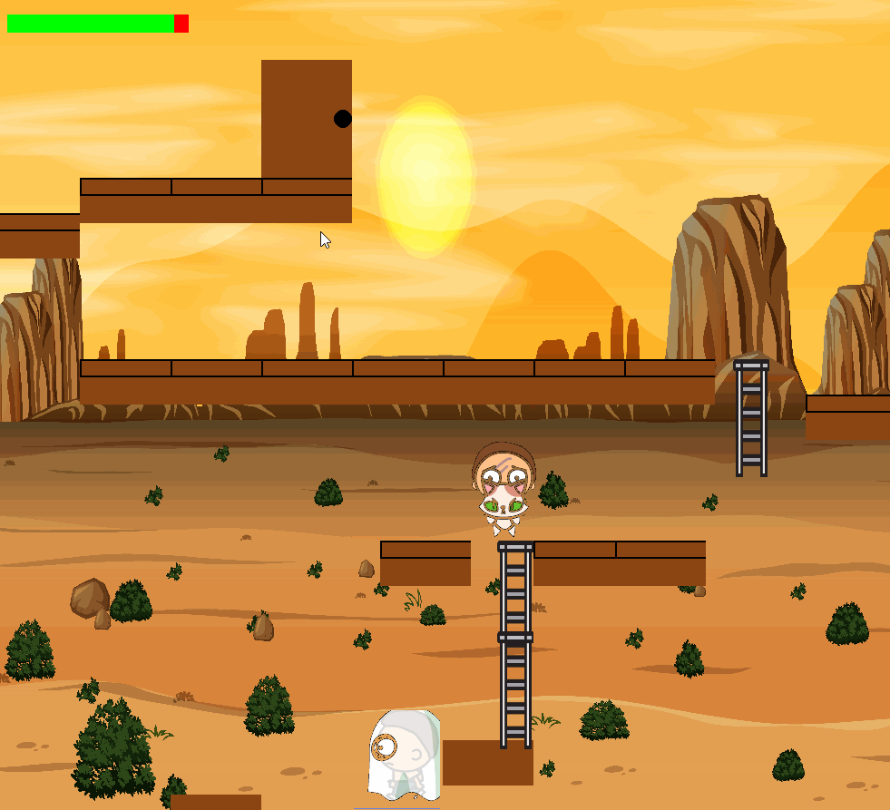
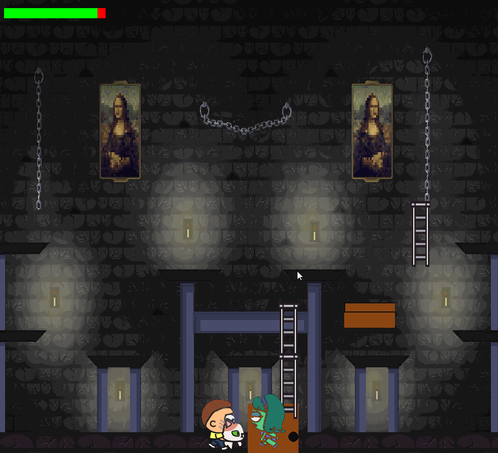

# Spacewalk - Pygame Platformer

Spacewalk is a 2D platformer game built with Pygame where players navigate through space-themed levels to reach a door that leads to the next challenge. Each level is filled with platforms, obstacles, and enemies that the player must overcome.

## Gameplay
Navigate through challenging levels, avoid enemies, and reach the door to progress. The game features custom animations and a variety of obstacles to keep the gameplay exciting and engaging.

## Game Features
- Animated characters and enemies.
- Multiple levels with increasing difficulty.
- Health bar system for the player character.
- Engaging sound effects and background music.

## Screenshots from the Game





## Installation

To play Spacewalk, you need to have Python and Pygame installed on your system.

1. Clone the repository to your local machine:
```bash
git clone https://github.com/yourusername/spacewalk.git
```

2. Navigate to the cloned repository:
```bash
cd spacewalk
```

3. Install the required dependencies:
```bash
pip install -r requirements.txt
```

## Usage

To start the game, run the following command in the terminal:
```bash
python main.py
```

## Contributing

Contributions to Spacewalk are welcome! Please read `CONTRIBUTING.md` for details on our code of conduct and the process for submitting pull requests.

## License

This project is licensed under the MIT License - see the `LICENSE.md` file for details.

## Acknowledgments

- Sprites and music used under license or from free resources.
- Pygame community for their extensive documentation and support.

## Contact

For any queries, you can reach out to [galindo.tech@gmail.com].

We hope you enjoy playing Spacewalk as much as we enjoyed making it!
